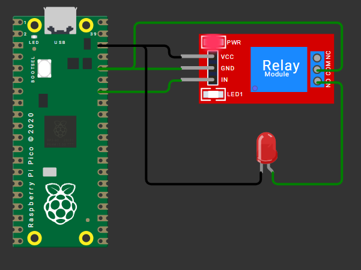
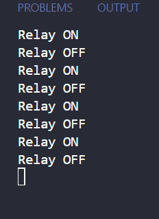

# Relay-Lamp-Pico
A basic Raspberry Pi Pico project to control an AC appliance (e.g., a lamp) using a relay module. This setup demonstrates how to safely control high-voltage devices using a low-voltage microcontroller.

## ⚙️ Hardware Diagram

> **Figure**: Wiring diagram of Arduino UNO with Relay module and AC Lamp

---

## 💻 Terminal Output

> **Figure**: Serial Monitor Output after uploading the sketch

---
